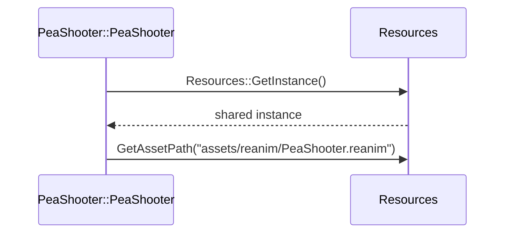

# Design Documentation Generator

## Deliverables required by the rubric, beyond source code

- Class diagrams
- Sequence diagrams explaining the use of design patterns (marked optional
  in the project description, but graded as part of "Design and
  Implementation" — do them)
- A written description of how OOP principles and design patterns are
  applied
- A demo video

None of these exist in the repo yet (no `docs/` folder, no diagrams). Keep
them as plain-text Mermaid inside markdown files under `docs/` rather than a
binary diagramming tool — Mermaid renders natively in GitHub and most
markdown viewers, and being plain text means it can be regenerated /
diffed / kept in sync by an agent as the codebase changes, unlike a `.drawio`
or image file.

## Class diagram — regenerate from headers, don't rely on memory

Source of truth: `grep` `include/*.h` for `: public Plant` and
`: public Zombie` to get the complete, current inheritance list — don't
trust a previously-generated diagram to still be accurate once new
subclasses have been added.

```mermaid
classDiagram
    class Plant {
        <<abstract>>
        +update()
        +draw()
        +takeDamage(int)
        +isDead() bool
    }
    class Zombie {
        <<abstract>>
        +update()
        +draw()
        +takeDamage(int)
        +isDead() bool
    }
    Plant <|-- PeaShooter
    Plant <|-- SnowPea
    Plant <|-- Repeater
    Plant <|-- GatlingPea
    Plant <|-- Cornpult
    Plant <|-- Melonpult
    Plant <|-- Jalapeno
    Plant <|-- SunFlower
    Plant <|-- Wallnut
    Plant <|-- CherryBomb
    Plant <|-- Chomper
    Plant <|-- FirePea
    Zombie <|-- ZombieNormal
    Zombie <|-- FlagZombie
    Plant *-- Reanimation
    Zombie *-- Reanimation
    Resources <<Singleton>>
```

Update this list whenever `pvz-entity-scaffold` is used to add a new
subclass — the two skills should stay in sync.

## Sequence diagrams — one per *implemented* pattern only

Cross-reference `design-patterns-tracker`'s table before drawing anything.
Only diagram patterns marked "Done" (or "Partial" if you're documenting the
partial state honestly) — don't document aspirational patterns as if they
exist. Example for the Singleton entry:



Add one of these per pattern as each moves from "Not started"/"Partial" to
"Done" in the tracker.

## Written description

Keep this as short, separate files per pattern rather than one long essay —
easier to keep accurate as code changes, and maps directly onto the
rubric's "description of how OOP principles, design patterns are applied":

```
docs/
├── class-diagram.md
└── patterns/
    ├── singleton.md      (Resources — where, why, alternative considered)
    ├── factory.md
    ├── state.md
    ├── observer.md
    └── strategy.md
```

Each pattern file should say: where it's implemented (file/class), why that
pattern was chosen over an alternative, and — for the interpretive rubric
items like `seed-deck-loadout`'s answer to "Multiple Players" — an explicit
note on how the implementation maps to the rubric's original wording.

## Demo video

Not something to generate directly, but maintain a short shot list in
`docs/demo-script.md` so recording isn't a last-minute scramble: which
level to show, which plants to place, and specifically calling out the
seed-deck screen (the "Multiple Players" answer) and at least one visible
moment per implemented design pattern (e.g. show a save/reload to
demonstrate the Command pattern, if built).
