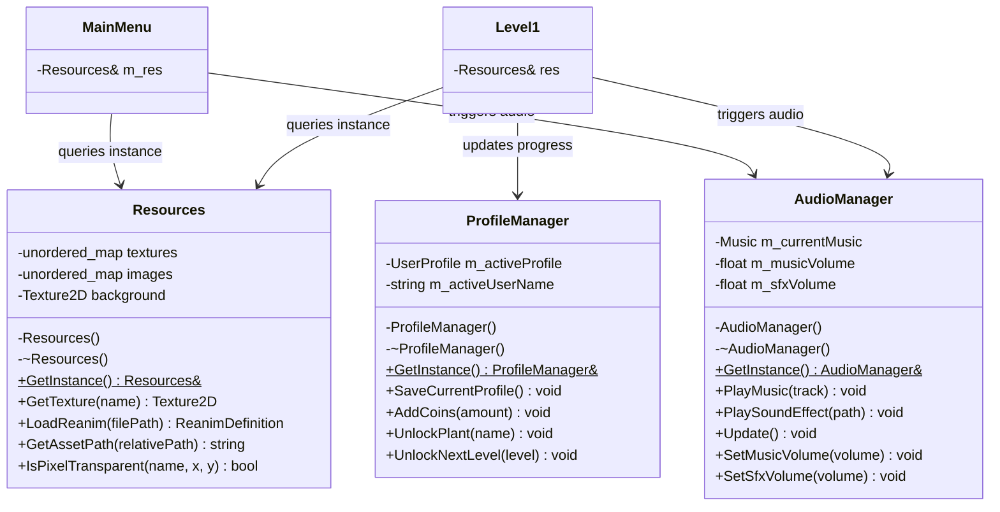
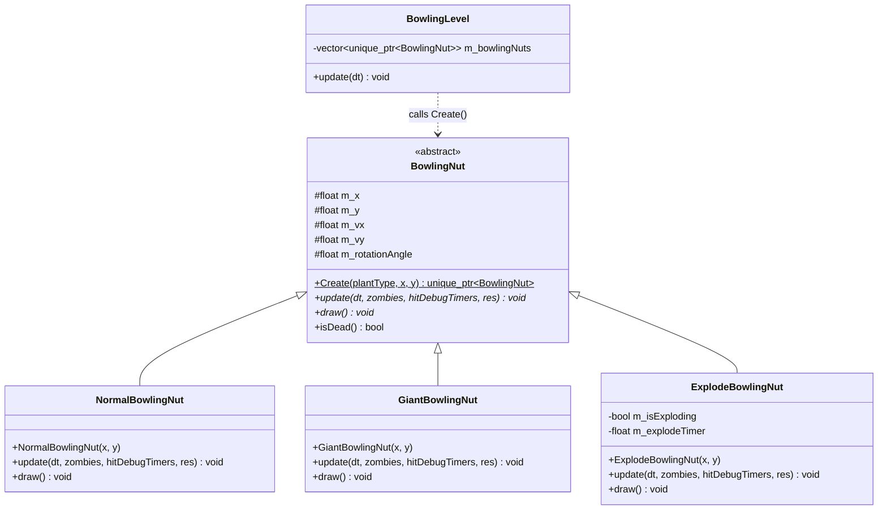
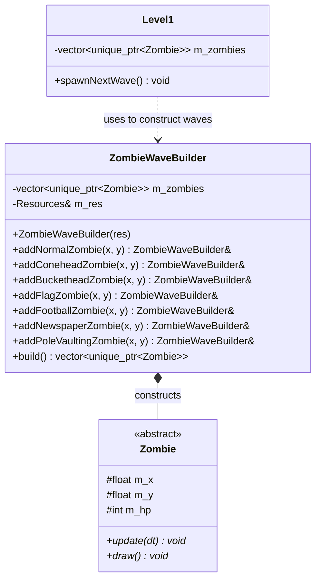
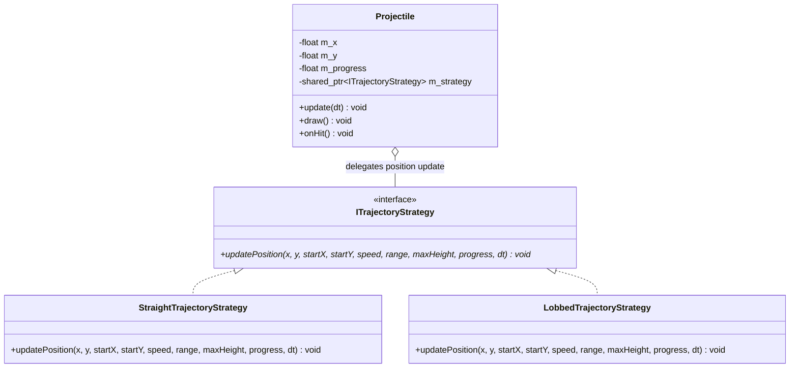
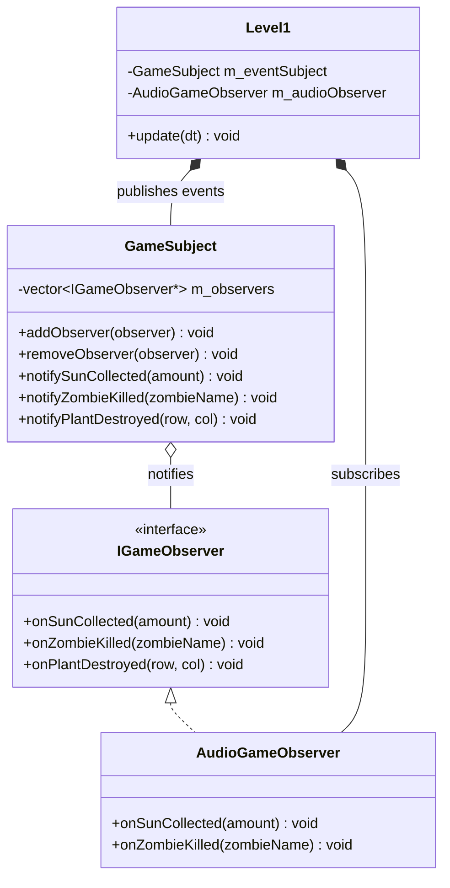
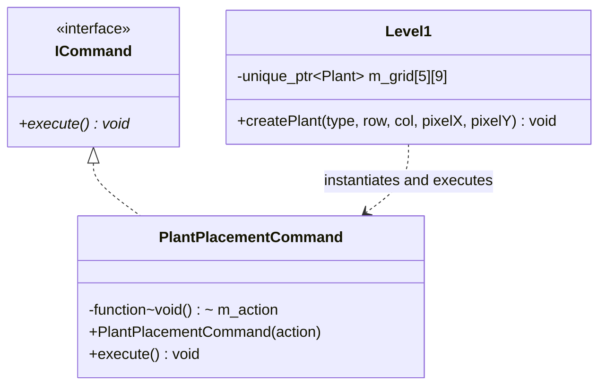
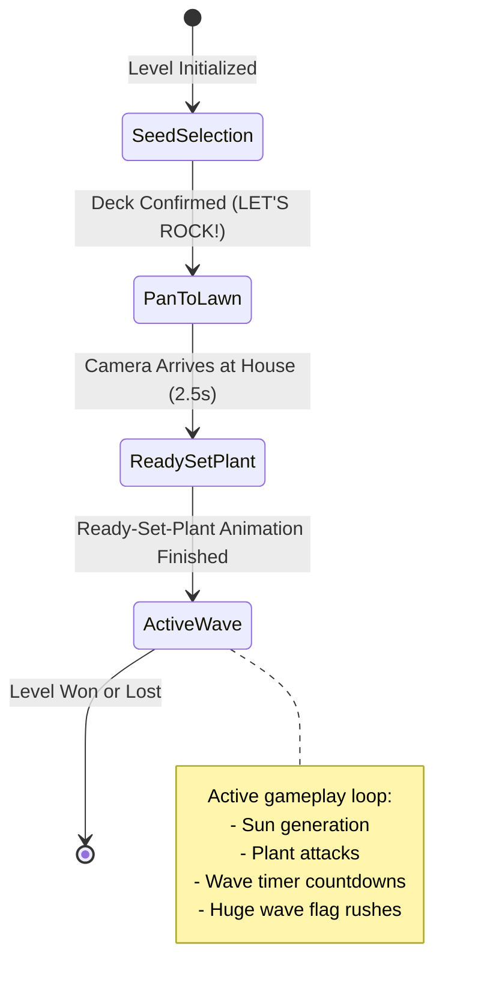
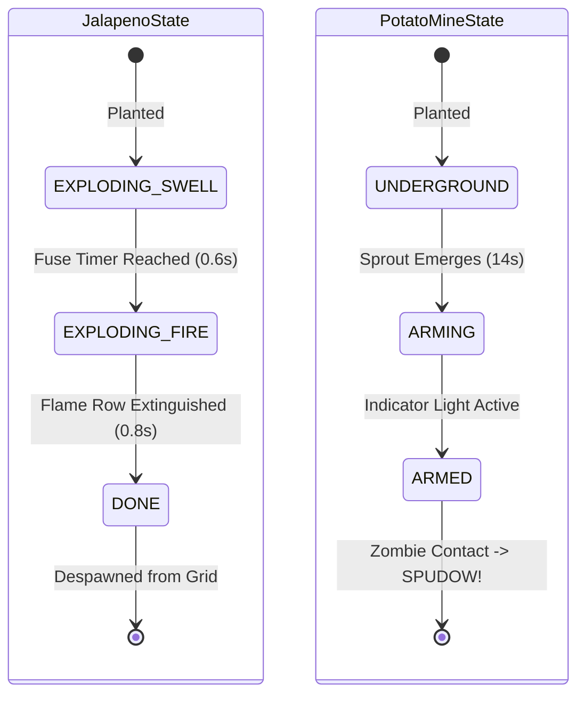
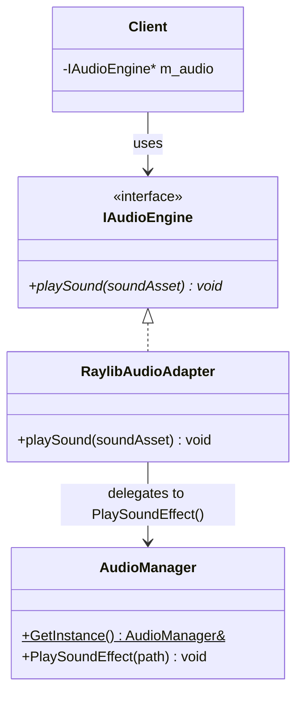
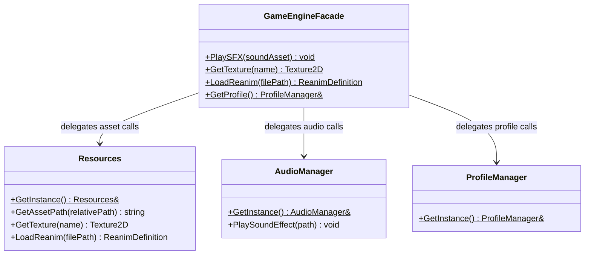

# CS202-GameProject
A "Plants Vs. Zombies"-inspired game for CS202 - Programming Systems course.

***Disclaimer:*** This repository is a non-commercial, educational project created solely for learning and teaching purposes. It is not affiliated with, authorized, or endorsed by *PopCap Games* or *Electronic Arts*. All trademarks and registered trademarks belong to their respective owners. Content is used here under Fair Use guidelines for educational analysis and instruction. This project does not aim to infringe on any copyrights and is not intended for distribution or sale. No financial profit is being made from this project. If you are the copyright holder and have concerns about this use, please contact us to address them promptly.

<!-- ## Agents and Skills -->
<!---->
<!-- ### Keeping these current -->
<!---->
<!-- Two of these skills are living documents meant to be edited as the project -->
<!-- evolves, not just read: -->
<!---->
<!-- - `.agents/skills/design-patterns-tracker/SKILL.md` — its status table should be updated -->
<!--   in the same commit as any change to a design pattern's implementation. -->
<!-- - `.agents/skills/game-state-and-levels/SKILL.md`'s save-file JSON schema and -->
<!--   `seed-deck-loadout/SKILL.md` should stay in sync on field names — check -->
<!--   one before editing the other. -->
<!---->
<!-- ### Open decision already made -->
<!---->
<!-- `.agents/skills/seed-deck-loadout` documents the chosen interpretation of the rubric's -->
<!-- "Multiple Players" item (a pre-level plant-loadout screen) — see that -->
<!-- skill's "Why this exists" section for the reasoning, and make sure the -->
<!-- final design doc states it explicitly rather than leaving a grader to -->
<!-- infer it. -->

---

## Codebase Architecture and Structure

This project is a C++20 implementation of a Plants vs. Zombies clone engineered using the Raylib multimedia framework. It incorporates a custom parsing, transformation, and rendering engine for PopCap's proprietary `.reanim` XML keyframe animation format, along with custom bitmap font typography, multi-user profile persistence, progressive asset loading, and wave-based level progression.

### Directory Layout and Module Organization

The codebase is organized into five modular subdirectories under `include/` and `src/`:

```
CS202-PlantsVsZombies/
│   ├── reanim/                      # PopCap .reanim keyframe animation XML definitions
│   ├── images/                      # Texture atlases, background lawn art, seed cards
│   ├── fonts/                       # Custom bitmap font descriptors and PNG atlases
│   ├── particles/                   # Particle effect textures and overlays
│   └── PlantSeedPackets/            # Seed packet UI graphics for all plant types
├── include/                         # Header files (.h)
│   ├── core/                        # Core runtime infrastructure and singletons
│   │   ├── AudioManager.h           # Centralized music streaming and SFX management
│   │   ├── BitmapFont.h             # PopCap bitmap font descriptor parser and renderer
│   │   ├── ProfileManager.h         # Multi-user profile persistence and save management
│   │   ├── Reanimation.h            # Skeletal animation controller and matrix compositor
│   │   ├── reanim.h                 # Struct definitions for keyframes, tracks, and ranges
│   │   └── resources.h              # Centralized asset manager (Meyer's Singleton)
│   ├── entities/                    # Game objects and entity hierarchies
│   │   ├── items/                   # Interactive items, projectiles, and environmental objects
│   │   │   ├── LawnMower.h          # Emergency row-clearing lawn mower entity
│   │   │   ├── Projectile.h         # Linear and lobbed trajectory projectile entity
│   │   │   ├── SunItem.h            # Sun currency entity with bezier collection physics
│   │   │   ├── Vase.h               # Breakable mystery vase entity for Vasebreaker mode
│   │   │   └── particle.h           # Particle emitter and burst effect structures
│   │   ├── plants/                  # Plant base class and all 20+ plant subclasses
│   │   │   ├── Plant.h              # Abstract base class for all plant entities
│   │   │   ├── PeaShooter.h         # Basic horizontal single-pea shooter
│   │   │   ├── SnowPea.h            # Freezing projectile shooter with slow debuff
│   │   │   ├── Repeater.h           # Rapid two-pea burst shooter
│   │   │   ├── GatlingPea.h         # Quad-pea barrage heavy shooter
│   │   │   ├── FirePea.h            # Double-damage flaming pea shooter
│   │   │   ├── SunFlower.h          # Sun generation economic unit
│   │   │   ├── Wallnut.h            # High-durability defensive shield with visual damage states
│   │   │   ├── CherryBomb.h         # 3x3 area-of-effect lethal explosive
│   │   │   ├── Jalapeno.h           # State-driven full-lane incinerator
│   │   │   ├── Chomper.h            # Melee devourer with extended chewing cooldown
│   │   │   ├── PotatoMine.h         # Underground contact explosive with arming delay
│   │   │   ├── Squash.h             # Proximity-triggered smashing entity
│   │   │   ├── Garlic.h             # Defensive entity that diverts zombies to adjacent rows
│   │   │   ├── Torchwood.h          # Projectile modifier that ignites peas on pass-through
│   │   │   ├── SpikeRock.h          # Reinforced ground hazard that punctures tires and armor
│   │   │   ├── Caltrop.h            # Basic ground spikeweed hazard
│   │   │   ├── IceShroom.h          # Screen-wide freeze and zombie immobilization
│   │   │   ├── Gravebuster.h        # Grave consumption utility for night stages
│   │   │   ├── Cornpult.h           # Lobbed catapult firing corn and stunning butter
│   │   │   ├── Cabbagepult.h        # Lobbed catapult launching heavy cabbages
│   │   │   ├── Melonpult.h          # Heavy lobbed catapult with splash damage radius
│   │   │   └── BowlingNut.h         # Physics-driven rolling Wall-nuts for minigame mode
│   │   └── zombies/                 # Zombie base class and all 7+ zombie subclasses
│   │       ├── Zombie.h             # Abstract base class with limb detachment physics
│   │       ├── ZombieNormal.h       # Standard browncoat zombie
│   │       ├── FlagZombie.h         # Fast wave leader carrying a flag
│   │       ├── ConeheadZombie.h     # Traffic cone armored zombie (+370 HP)
│   │       ├── BucketheadZombie.h   # Steel bucket heavy armored zombie (+1100 HP)
│   │       ├── FootballZombie.h     # High-speed athlete zombie with heavy helmet
│   │       ├── NewspaperZombie.h    # Shielded zombie with enraged dash transition
│   │       └── PoleVaultingZombie.h # Vaulting zombie with plant-jumping traversal
│   ├── level/                       # Level progression and minigame loops
│   │   ├── Level1.h                 # Adventure Level 1 base class and game loop
│   │   ├── Level2.h                 # Adventure Level 2 (Day stage with Coneheads)
│   │   ├── Level3.h                 # Adventure Level 3 (Day stage with multi-flags)
│   │   ├── Level4.h                 # Adventure Level 4 (Night stage with Gravestones)
│   │   ├── Level5.h                 # Adventure Level 5 (Night stage with grave risers)
│   │   ├── Level6.h                 # Adventure Level 6 (Night climax wave stage)
│   │   ├── BowlingLevel.h           # Wall-nut Bowling minigame with conveyor belt UI
│   │   └── VasebreakerLevel.h       # Vasebreaker puzzle mode with mallet interaction
│   ├── ui/                          # Menus, HUD components, and dialogs
│   │   ├── AlmanacMenu.h            # Suburban Almanac with live animated preview models
│   │   ├── HelpMenu.h               # Interactive help and instructions parchment
│   │   ├── InGameMenu.h             # In-game pause modal with options and restart
│   │   ├── LevelSelectMenu.h        # Stage progression tree (Day and Night chapters)
│   │   ├── LoadingScreen.h          # Dirt/grass progressive asset load bar
│   │   ├── MainMenu.h               # Interactive tombstone menu (SelectorScreen.reanim)
│   │   ├── OptionsMenu.h            # Settings overlay (volume sliders, resolution presets)
│   │   ├── QuizMenu.h               # Crazy Dave's trivia quiz with rewards
│   │   ├── SeedBank.h               # Top HUD bar displaying sun count and selected cards
│   │   ├── SeedPacket.h             # Seed card cooldown sweeps and drag-and-drop
│   │   ├── SeedSelectMenu.h         # Pre-level plant deck builder (Loadout screen)
│   │   ├── ShopMenu.h               # Crazy Dave's Twiddydinkies car trunk shop
│   │   ├── UIHelpers.h              # Virtual mouse scaling and immediate-mode buttons
│   │   └── UserDialog.h             # Player profile management dialog
│   └── utils/                       # Diagnostic and testing utilities
│       └── testing.h                # Zen Garden animation and hitbox visualizer
├── src/                             # C++ Source implementation files
│   ├── core/                        # Implementations for runtime singletons and parsers
│   ├── entities/                    # Implementations for plants, zombies, and items
│   ├── level/                       # Implementations for adventure levels and minigames
│   ├── ui/                          # Implementations for menus and interface elements
│   ├── utils/                       # Implementations for test harnesses
│   └── main.cpp                     # Application entry point and top-level render loop
├── build.sh                         # Full CMake configuration and release build script
├── remake.sh                        # Fast incremental compile script for existing files
└── CMakeLists.txt                   # Build specification with Raylib, raygui, and nlohmann_json
```

---

## Core Subsystems and Engine Architecture

### 1. PopCap Reanim Keyframe Animation Engine

The animation subsystem (`reanim.h`, `Reanimation.h`, `Reanimation.cpp`, `resources.h`) provides full real-time reconstruction of PopCap's XML skeletal animation format.

* **Keyframe XML Parsing and Value Inheritance**: The parser reads tracks and keyframes (`<t>`) sequentially. Properties not explicitly modified on a keyframe (such as coordinates $x, y$, scale $s_x, s_y$, rotation $k_x, k_y$, or texture bindings) inherit their values directly from the preceding frame ($N-1$).
* **Hidden Track Sentinels**: Tracks containing the `<f>-1</f>` frame property are hidden during rendering passes, allowing dynamic attachment and detachment of visual parts (such as hats, shields, or limbs).
* **2D Affine Transformation Matrix**: For each active track at keyframe $t$, the engine computes an affine transformation matrix combining scale ($s_x, s_y$) and rotation/skew ($k_x, k_y$):

$$\begin{bmatrix} m_{00} & m_{10} \\ m_{01} & m_{11} \end{bmatrix} = \begin{bmatrix} s_x \cos(k_x) & s_x \sin(k_x) \\ -s_y \sin(k_y) & s_y \cos(k_y) \end{bmatrix}$$

* **OpenGL Matrix Stack Pipeline**: Visual tracks are rendered using Raylib's low-level matrix stack: `rlPushMatrix()`, `rlMultMatrixf()`, `rlDrawRenderBatchActive()`, and `rlPopMatrix()`, ensuring hardware-accelerated composite drawing.
* **Dual-Layer Animation Blending**: Supports simultaneous playback of a base locomotion track (such as a zombie walking loop) blended with an independent upper-body overlay sequence (such as a biting or eating track).
* **Frame-Exact Debounce Pattern**: Entity firing actions check exact keyframe indices. When a plant triggers a projectile spawn on frame $N$, it sets an internal `did_shoot` flag, which is cleared on frame $N+1$ to prevent duplicate instantiations during the keyframe window.

### 2. Centralized Audio Management (`AudioManager`)

Audio playback is managed via a Meyer's Singleton (`include/core/AudioManager.h`, `src/core/AudioManager.cpp`) wrapping Raylib's audio streaming engine:

* **Music Streaming**: Handles smooth transitions between background tracks (`MusicTrack::MainMenu`, `DayStage`, `NightStage`, `Bowling`, `Vasebreaker`, `ZenGarden`, `CrazyDaveTheme`, `WinMusic`, `LoseMusic`).
* **Volume Attenuation**: Provides synchronized dynamic volume scaling for background music and concurrent multi-channel sound effects.
* **Global Stream Pumping**: Invokes `UpdateMusicStream()` once per frame in the main execution loop to prevent buffer underruns.

### 3. Player Profile and Persistence Engine (`ProfileManager`)

User progress is persisted across sessions via a dedicated Singleton (`include/core/ProfileManager.h`, `src/core/ProfileManager.cpp`):

* **JSON Serialization**: Stores player profiles (`UserProfile`) containing active coin balance, unlocked plant card catalogs, and maximum level completion records.
* **Multi-User Management**: Supports creating, renaming, deleting, and switching player profiles dynamically via `UserDialog`.
* **Deck Unlocking Progression**: Manages the default starter deck and validates plant card availability during the pre-level seed chooser phase.

### 4. Custom Typography and Bitmap Font Engine (`BitmapFont`)

PopCap UI typography is rendered through a custom bitmap font parser (`include/core/BitmapFont.h`, `src/core/BitmapFont.cpp`):

* **Descriptor Parser**: Reads XML and TXT font descriptor metrics paired with PNG texture atlases (`DwarvenTodcraft24`, `HouseofTerror28`, `BrianneTod16`, `ContinuumBold14`).
* **Packed Integer Kerning**: Uses a packed 16-bit integer map (`uint16_t` key constructed as `((c1 << 8) | c2)`) to eliminate dynamic heap allocations during per-character kerning lookups.
* **Text Layout Capabilities**: Supports centered text rendering, line height scaling, character offsets, and automated word wrapping within bounded rectangles.

### 5. Virtual Resolution and UI Engine (`UIHelpers`)

* **Fixed Virtual Canvas**: All game rendering occurs on a fixed 800x600 `RenderTexture2D` canvas, which is stretched to fit the physical window using `DrawTexturePro()` with hardware bilinear filtering.
* **Virtual Mouse Transformation**: `SetVirtualMouseScale()` maps actual window mouse coordinates to the 800x600 virtual canvas coordinates, ensuring hitboxes align across all display resolutions.
* **Pixel-Perfect Alpha Hit Testing**: `Resources::IsPixelTransparent()` inspects CPU-side image pixel buffers to perform exact hit-testing on irregular non-rectangular buttons (such as main menu tombstones).
* **Modal Input Locking**: `SetUIInteractionEnabled()` disables background UI hover and click processing when modal overlays (options, shop, help) are open.

---

## Entity Hierarchy and Game Mechanics

```
                         +-------------------------+
                         |      Resources          | (Singleton)
                         +-------------------------+
                                      |
              +-----------------------+-----------------------+
              |                       |                       |
              v                       v                       v
     +-----------------+     +-----------------+     +-----------------+
     |   Reanimation   |     |   BitmapFont    |     | ProfileManager  |
     +-----------------+     +-----------------+     +-----------------+

                                 +---------+
                                 |  Plant  | (Abstract Base)
                                 +----+----+
          +---------------+-----------+-----------+---------------+
          |               |           |           |               |
          v               v           v           v               v
     PeaShooter       SunFlower    Wallnut    CherryBomb       Jalapeno
     SnowPea          Torchwood    Garlic     PotatoMine       Chomper
     Repeater         Caltrop      SpikeRock  Squash           IceShroom
     GatlingPea       Cornpult     Melonpult  Cabbagepult      BowlingNut

                                 +---------+
                                 | Zombie  | (Abstract Base)
                                 +----+----+
          +---------------+-----------+-----------+---------------+
          |               |           |           |               |
          v               v           v           v               v
     ZombieNormal    FlagZombie  ConeheadZombie BucketheadZombie FootballZombie
                                 NewspaperZombie PoleVaultingZombie
```

### 1. Plant Taxonomy (`Plant.h`)

All plants derive from the abstract base class `Plant`, which defines integer grid positions ($m_x, m_y$), current and max health ($m_hp, m_maxHp$), sun cost, recharge timers, and pure virtual `update()` and `draw()` methods.

* **Linear Projectile Shooters**: `PeaShooter`, `SnowPea` (applies a chilling slow debuff), `Repeater` (two-shot burst), `GatlingPea` (four-shot barrage), and `FirePea` ($2\times$ damage).
* **Lobbed Catapults**: `Cabbagepult`, `Cornpult` (flings corn kernels and occasional butter that stuns zombies for 4 seconds), and `Melonpult` (launches heavy melons inflicting splash damage across adjacent tiles).
* **Economic Producers**: `SunFlower` (produces 25 sun currency every 24 seconds with a pulsing glow animation).
* **Defensive Shields**: `Wallnut` (4000 HP barrier that swaps texture tracks dynamically to display cracked and severely damaged states).
* **Tactical Disruptors**: `Garlic` (diverts zombies biting it to adjacent lanes), `Torchwood` (transforms normal peas into fire peas), `SpikeRock` and `Caltrop` (ground hazards that puncture zombie feet and vehicles), and `IceShroom` (temporarily immobilizes all zombies on screen).
* **Instant Area-of-Effect Explosives**: `CherryBomb` (detonates in a 3x3 grid radius dealing 1800 damage), `Jalapeno` (incinerates an entire horizontal row), `PotatoMine` (arms underground after 14 seconds and detonates on contact), and `Squash` (jumps and crushes approaching zombies).

### 2. Zombie Taxonomy (`Zombie.h`)

All zombies derive from the abstract base class `Zombie`, utilizing continuous float coordinates ($m_x, m_y$) for smooth movement, walk speeds, damage-per-tick values, eating states, and `FallingPart` particle physics for detached limbs.

* **Standard and Swarm Types**: `ZombieNormal` and `FlagZombie` (leads huge waves with increased walk speed).
* **Multi-Layer Armored Types**: `ConeheadZombie` (cone armor absorption) and `BucketheadZombie` (bucket armor absorption with visual dent stages). Armor breaks and pops off as physics particles before base body damage occurs.
* **Specialist Types**: `FootballZombie` (high-velocity athlete with heavy armor durability), `NewspaperZombie` (absorbs damage with a newspaper shield; when destroyed, enraged with double walk speed and attack rate), and `PoleVaultingZombie` (sprints and leaps over the first plant barrier before resuming a standard walk).

### 3. Projectiles, Currency, and Interactive Items

* **`Projectile`**: Encapsulates linear horizontal motion for peas and parabolic arc trajectories for catapults:
  $$y(t) = y_0 - 4h \cdot \left(\frac{x - x_0}{x_{\text{target}} - x_0}\right) \left(1 - \frac{x - x_0}{x_{\text{target}} - x_0}\right)$$
* **`SunItem`**: Manages falling sky suns and plant-produced suns with gravity physics, ground settling, click hitboxes, and smooth bezier collection flight toward the top-left SeedBank.
* **`LawnMower`**: Stationed at the left edge of each row. When a zombie breaches the lawn, the mower activates, rolling forward at high speed to clear all zombies in that lane.
* **`Vase`**: Breakable mystery containers used in Vasebreaker mode with leaf decals (plant) and zombie decals.

---

## Level Progression and Game Modes

### 1. Adventure Mode (Levels 1 to 6)

The adventure campaign provides progressive gameplay with distinct daytime and nighttime mechanics:

* **Daytime Stages (Levels 1–3)**:
  * Camera pan intro showing upcoming zombie threats.
  * "READY... SET... PLANT!" opening sequence.
  * 5x9 lawn grid plant placement with click-to-plant and shovel tools.
  * Sun economy with periodic sky drops.
  * Wave timers, progress bar tracking, huge wave announcements, and final wave flag rushes.
  * Victory award drop presentation and defeat sequences.
* **Nighttime Stages (Levels 4–6)**:
  * Dark atmosphere with zero sky sun drops, requiring sun-producing plants.
  * Procedurally placed gravestones (`GraveStone`) occupying grid cells.
  * Graves rise dynamically and spawn nocturnal zombies during final wave rushes.
  * `Gravebuster` integration for clearing cemetery obstacles.

### 2. Wall-nut Bowling Minigame (`BowlingLevel`)

A specialized minigame mode modeled on PopCap's conveyor belt mechanics:

* **Conveyor Belt UI**: Displays available Wall-nut cards moving smoothly from right to left with capacity gating (10 cards maximum).
* **Physics-Based Rolling Nuts**: Normal Wall-nuts bounce diagonally off top and bottom lawn boundaries upon impact with zombies. Giant Wall-nuts roll continuously through entire rows, crushing all zombies in their path. Explode-o-nuts detonate on first impact, clearing a 3x3 tile radius.

### 3. Vasebreaker Puzzle Mode (`VasebreakerLevel`)

A tactical puzzle mode where all plants and zombies are concealed inside mystery vases:

* **5x9 Vase Matrix**: Vases are divided between green plant vases and brown mystery/zombie vases.
* **Mallet Cursor Interaction**: Animated hammer strike with delayed hit debouncing (`VaseState::PendingBreak`) to prevent duplicate clicks during swing animations.
* **Dropped Seed Packets**: Shattered plant vases drop seed packets that fall to the ground with gravity physics, ready for tactical placement.

### 4. Zen Garden and Animation Inspector (`Testing`)

A real-time diagnostic visualizer allowing developers to spawn any plant or zombie, inspect keyframe tracks, test attack frame debouncing, and verify hitbox alignment.

---

## Design and Implementation of OOP Design Patterns

The codebase implements nine Object-Oriented Design Patterns across creational, structural, and behavioral categories to maintain modularity, testability, and separation of concerns.

```
Creational Patterns:
  [Singleton]       -----> Resources, AudioManager, ProfileManager
  [Factory Method]  -----> BowlingNut::Create()
  [Builder]         -----> ZombieWaveBuilder

Behavioral Patterns:
  [Strategy]        -----> ITrajectoryStrategy (StraightTrajectoryStrategy, LobbedTrajectoryStrategy)
  [Observer]        -----> GameSubject, IGameObserver, AudioGameObserver
  [Command]         -----> ICommand, PlantPlacementCommand
  [State]           -----> LevelPhase, QuizState, JalapenoState, PotatoMineState, VaseState

Structural Patterns:
  [Adapter]         -----> IAudioEngine, RaylibAudioAdapter
  [Facade]          -----> GameEngineFacade
```

---

### 1. Singleton Pattern (Creational)

* **Concrete Implementations**:
  * `Resources` (`include/core/resources.h`, `src/core/resources.cpp`)
  * `AudioManager` (`include/core/AudioManager.h`, `src/core/AudioManager.cpp`)
  * `ProfileManager` (`include/core/ProfileManager.h`, `src/core/ProfileManager.cpp`)
* **Design Structure**:
  Implemented using the Meyer's Singleton idiom, utilizing static local instance initialization within `GetInstance()`. Constructors and destructors are declared private, and copy constructors and copy assignment operators are explicitly deleted.
* **Architectural Rationale**:
  * **GPU Resource Integrity**: Loading textures, font atlases, and `.reanim` XML definitions into GPU VRAM must happen exactly once. Multiple instances of `Resources` would duplicate memory buffers, degrade frame rates, and cause GPU resource leakage.
  * **Audio Stream Synchronization**: Raylib requires a single streaming pump call (`UpdateMusicStream`) per frame. Centralizing audio in `AudioManager` prevents competing stream updates and race conditions.
  * **Data Consistency**: Player profile save files (coins, unlocked plants, max level) are serialized through `ProfileManager`, ensuring single-threaded I/O operations without file locking conflicts.

#### Class Diagram



#### Code Implementation

```cpp
class Resources {
public:
    static Resources& GetInstance() {
        static Resources instance; // Guaranteed lazy initialization and destruction
        return instance;
    }

    Resources(const Resources&) = delete;
    Resources& operator=(const Resources&) = delete;

    Texture2D GetTexture(const std::string& name) const;
    ReanimDefinition LoadReanim(const std::string& filePath);
    std::string GetAssetPath(const std::string& relativePath);

private:
    Resources() = default;
    ~Resources() = default;
};
```

---

### 2. Factory Method Pattern (Creational)

* **Concrete Implementation**:
  * `BowlingNut::Create(const std::string& plantType, float x, float y)` (`include/entities/plants/BowlingNut.h`, `src/entities/plants/BowlingNut.cpp`)
* **Design Structure**:
  The static factory method `BowlingNut::Create` acts as a parameterized factory that instantiates and returns derived `BowlingNut` polymorphic objects (`NormalBowlingNut`, `GiantBowlingNut`, `ExplodeBowlingNut`) wrapped in `std::unique_ptr<BowlingNut>`.
* **Architectural Rationale**:
  * **Encapsulation of Subclass Instantiation**: In Wall-nut Bowling mode, the conveyor belt card dispenser selects cards at runtime. Instead of the level loop executing complex instantiation logic, `Create()` encapsulates velocity configuration, rotation speed, health, bounce physics, and explosion timers.
  * **Open-Closed Principle (OCP)**: New bowling nut variants (such as slow-motion nuts or magnetized nuts) can be added by extending `BowlingNut` and updating the factory switch without modifying `BowlingLevel.cpp`.

#### Class Diagram



#### Code Implementation

```cpp
std::unique_ptr<BowlingNut> BowlingNut::Create(const std::string& plantType, float x, float y) {
    if (plantType == "GiantWallnut") {
        return std::make_unique<GiantBowlingNut>(x, y);
    } else if (plantType == "ExplodeNut") {
        return std::make_unique<ExplodeBowlingNut>(x, y);
    }
    return std::make_unique<NormalBowlingNut>(x, y);
}
```

---

### 3. Builder Pattern (Creational)

* **Concrete Implementation**:
  * `ZombieWaveBuilder` (`include/utils/WaveBuilder.h`)
  * Integrated in `Level1::spawnNextWave()` (`src/level/Level1.cpp`)
* **Design Structure**:
  `ZombieWaveBuilder` provides a fluent interface with method chaining (`addNormalZombie`, `addConeheadZombie`, `addBucketheadZombie`, `addFlagZombie`, etc.) to construct complex collections of `std::unique_ptr<Zombie>`, finalized via `build()`.
* **Architectural Rationale**:
  * **Fluent Step-by-Step Assembly**: Zombie waves in Plants vs. Zombies consist of diverse combinations of zombies spawning at staggered lane coordinates. Constructing each zombie manually requires repetitive resource passing and coordinate calculation.
  * **Ownership Transfer via Move Semantics**: `build()` transfers ownership of the allocated `std::vector<std::unique_ptr<Zombie>>` directly into the level's active entity vector via `std::move`, eliminating unnecessary copies.

#### Class Diagram



#### Code Implementation

```cpp
class ZombieWaveBuilder {
private:
    std::vector<std::unique_ptr<Zombie>> m_zombies;
    Resources& m_res;

public:
    explicit ZombieWaveBuilder(Resources& res) : m_res(res) {}

    ZombieWaveBuilder& addNormalZombie(float x, float y) {
        m_zombies.push_back(std::make_unique<ZombieNormal>(m_res, x, y));
        return *this;
    }

    ZombieWaveBuilder& addConeheadZombie(float x, float y) {
        m_zombies.push_back(std::make_unique<ConeheadZombie>(m_res, x, y));
        return *this;
    }

    std::vector<std::unique_ptr<Zombie>> build() {
        return std::move(m_zombies);
    }
};

// Usage in Level1::spawnNextWave():
ZombieWaveBuilder builder(res);
auto wave1Zombies = builder.addNormalZombie(spawnX, laneY(2)).build();
for (auto& z : wave1Zombies) {
    m_zombies.push_back(std::move(z));
}
```

---

### 4. Strategy Pattern (Behavioral)

* **Concrete Implementation**:
  * `ITrajectoryStrategy`, `StraightTrajectoryStrategy`, `LobbedTrajectoryStrategy` (`include/entities/items/TrajectoryStrategy.h`)
  * Integrated into `Projectile` (`include/entities/items/Projectile.h`, `src/Projectile.cpp`)
* **Design Structure**:
  `ITrajectoryStrategy` defines the interface for projectile spatial movement. `StraightTrajectoryStrategy` executes linear horizontal translation, while `LobbedTrajectoryStrategy` evaluates a parametric parabolic arc. `Projectile` acts as the Context holding a `std::shared_ptr<ITrajectoryStrategy>`.
* **Architectural Rationale**:
  * **Decoupling Math from Rendering**: Straight peas (PeaShooter, SnowPea, FirePea, GatlingPea) and lobbed projectiles (Cabbage, Corn, Melon) share common collision and particle logic but differ entirely in spatial movement equations.
  * **Elimination of Conditional Branching**: Encapsulating flight math into interchangeable strategy classes eliminates hardcoded `if (m_isLobbed)` branches inside the hot per-frame `Projectile::update()` loop.

#### Class Diagram



#### Code Implementation

```cpp
class ITrajectoryStrategy {
public:
    virtual ~ITrajectoryStrategy() = default;
    virtual void updatePosition(float& x, float& y, float startX, float startY, float speed, float range, float maxHeight, float& progress, float dt) = 0;
};

class StraightTrajectoryStrategy : public ITrajectoryStrategy {
public:
    void updatePosition(float& x, float& y, float startX, float startY, float speed, float range, float maxHeight, float& progress, float dt) override {
        x += speed * dt;
    }
};

class LobbedTrajectoryStrategy : public ITrajectoryStrategy {
public:
    void updatePosition(float& x, float& y, float startX, float startY, float speed, float range, float maxHeight, float& progress, float dt) override {
        if (range <= 0.0f) range = 400.0f;
        progress += (speed / range) * dt;
        if (progress > 1.0f) progress = 1.0f;

        x = startX + progress * range;
        float heightOffset = 4.0f * maxHeight * progress * (1.0f - progress);
        y = startY - heightOffset;
    }
};

// Delegated update in Projectile::update(dt):
if (m_strategy) {
    m_strategy->updatePosition(m_x, m_y, m_startX, m_startY, m_speed, m_range, m_maxHeight, m_progress, dt);
    if (m_isLobbed && m_progress >= 1.0f) {
        onHit();
    }
}
```

---

### 5. Observer Pattern (Behavioral)

* **Concrete Implementation**:
  * `IGameObserver`, `GameSubject`, `AudioGameObserver` (`include/utils/GameObserver.h`)
  * Integrated into `Level1` (`include/level/Level1.h`, `src/level/Level1.cpp`)
* **Design Structure**:
  `GameSubject` manages a dynamic collection of `IGameObserver*` subscribers. When key gameplay events occur (sun collected, zombie eliminated, plant destroyed), `GameSubject` broadcasts notifications to all registered observers.
* **Architectural Rationale**:
  * **Decoupled System Interactions**: In gameplay loops, actions in the physics/entity layer trigger reactions across audio, UI, scoring, and level tracking.
  * **Loose Coupling**: With the Observer pattern, entity objects do not need direct references to HUD elements or audio managers. Subsystems subscribe independently to `GameSubject` events.

#### Class Diagram



#### Code Implementation

```cpp
class IGameObserver {
public:
    virtual ~IGameObserver() = default;
    virtual void onSunCollected(int amount) {}
    virtual void onZombieKilled(const std::string& zombieName) {}
    virtual void onPlantDestroyed(int row, int col) {}
};

class GameSubject {
private:
    std::vector<IGameObserver*> m_observers;

public:
    void addObserver(IGameObserver* observer) {
        if (observer && std::find(m_observers.begin(), m_observers.end(), observer) == m_observers.end()) {
            m_observers.push_back(observer);
        }
    }

    void notifySunCollected(int amount) {
        for (auto* obs : m_observers) {
            if (obs) obs->onSunCollected(amount);
        }
    }

    void notifyZombieKilled(const std::string& zombieName) {
        for (auto* obs : m_observers) {
            if (obs) obs->onZombieKilled(zombieName);
        }
    }
};
```

---

### 6. Command Pattern (Behavioral)

* **Concrete Implementation**:
  * `ICommand`, `PlantPlacementCommand` (`include/utils/PlantCommand.h`)
  * Integrated into `Level1::createPlant()` (`src/level/Level1.cpp`)
* **Design Structure**:
  `ICommand` defines the abstract interface with `execute()`. `PlantPlacementCommand` encapsulates the concrete plant placement routine as a closure via `std::function<void()>`.
* **Architectural Rationale**:
  * **Encapsulation of User Actions**: Wrapping plant grid placement into command objects decouples the click-detection UI from grid modification.
  * **Foundation for Action Queues and Replays**: Command encapsulation allows storing command histories for undo/redo actions, replay recording, and multiplayer network synchronization.

#### Class Diagram



#### Code Implementation

```cpp
class ICommand {
public:
    virtual ~ICommand() = default;
    virtual void execute() = 0;
};

class PlantPlacementCommand : public ICommand {
private:
    std::function<void()> m_action;

public:
    explicit PlantPlacementCommand(std::function<void()> action)
        : m_action(action) {}

    void execute() override {
        if (m_action) {
            m_action();
        }
    }
};

// Execution in Level1::createPlant():
PlantPlacementCommand cmd([this, type, row, col, pixelX, pixelY]() {
    if (type == "PeaShooter") {
        m_grid[row][col] = std::make_unique<PeaShooter>(res, pixelX, pixelY);
    } else if (type == "SunFlower") {
        m_grid[row][col] = std::make_unique<SunFlower>(res, pixelX, pixelY);
    }
    // Additional plant types...
});
cmd.execute();
```

---

### 7. State Pattern (Behavioral)

* **Concrete Implementations**:
  * `LevelPhase` in `Level1.h` (`SeedSelection`, `PanToLawn`, `ReadySetPlant`, `ActiveWave`)
  * `QuizState` in `QuizMenu.h` (`Rules`, `Playing`, `AnswerFeedback`, `Summary`)
  * `JalapenoState` in `Jalapeno.h` (`EXPLODING_SWELL`, `EXPLODING_FIRE`, `DONE`)
  * `PotatoMineState` in `PotatoMine.h` (`UNDERGROUND`, `ARMING`, `ARMED`)
  * `VaseState` in `Vase.h` (`Intact`, `PendingBreak`, `Broken`)
* **Design Structure**:
  Finite state machines manage operational phases across level orchestration, menu flows, and entity animation lifecycles.
* **Architectural Rationale**:
  * **Guaranteed Transition Invariants**: Entities like Jalapeno and Potato Mine must execute strictly ordered states (fuse swelling $\rightarrow$ lane incineration $\rightarrow$ removal; unearthing delay $\rightarrow$ armed detonation). State machines prevent illegal transitions and race conditions during rapid user input.
  * **Input Protection**: In Vasebreaker mode, setting `VaseState::PendingBreak` on mallet click prevents duplicate strikes and redundant particle bursts during the hammer swing window.

#### State Transition Diagram



#### Entity Lifecycle Diagram (Jalapeno & Potato Mine)



---

### 8. Adapter Pattern (Structural)

* **Concrete Implementation**:
  * `IAudioEngine`, `RaylibAudioAdapter` (`include/core/AudioAdapter.h`)
* **Design Structure**:
  `IAudioEngine` acts as the target interface defining generic audio playback (`playSound`). `RaylibAudioAdapter` adapts Raylib's native `AudioManager::GetInstance().PlaySoundEffect()` to conform to `IAudioEngine`.
* **Architectural Rationale**:
  * **Framework Decoupling**: Direct dependencies on Raylib audio APIs across dozens of game classes create tight coupling. The adapter provides a generic audio interface that facilitates mock testing and simplifies potential future migrations to other multimedia frameworks (such as SDL2 or FMOD).

#### Class Diagram



#### Code Implementation

```cpp
// Target interface
class IAudioEngine {
public:
    virtual ~IAudioEngine() = default;
    virtual void playSound(const std::string& soundAsset) = 0;
};

// Adapter adapting Raylib's AudioManager to IAudioEngine
class RaylibAudioAdapter : public IAudioEngine {
public:
    void playSound(const std::string& soundAsset) override {
        AudioManager::GetInstance().PlaySoundEffect(soundAsset);
    }
};
```

---

### 9. Facade Pattern (Structural)

* **Concrete Implementation**:
  * `GameEngineFacade` (`include/core/GameEngineFacade.h`)
* **Design Structure**:
  `GameEngineFacade` provides a static, simplified facade interface over three distinct core subsystems: `Resources`, `AudioManager`, and `ProfileManager`.
* **Architectural Rationale**:
  * **Simplified Subsystem Access**: High-level gameplay systems frequently need to trigger sounds, query textures, and update player profiles simultaneously. `GameEngineFacade` wraps these disparate singleton interactions into unified static calls, shielding high-level components from complex subsystem initialization details.

#### Class Diagram



#### Code Implementation

```cpp
class GameEngineFacade {
public:
    static void PlaySFX(const std::string& soundAsset) {
        std::string fullPath = Resources::GetInstance().GetAssetPath(soundAsset);
        AudioManager::GetInstance().PlaySoundEffect(fullPath);
    }

    static Texture2D GetTexture(const std::string& name) {
        return Resources::GetInstance().GetTexture(name);
    }

    static ReanimDefinition LoadReanim(const std::string& filePath) {
        return Resources::GetInstance().LoadReanim(filePath);
    }

    static ProfileManager& GetProfile() {
        return ProfileManager::GetInstance();
    }
};
```

---

## Build and Compilation Instructions

### Prerequisites

* CMake 3.20 or higher
* C++20 compliant compiler (GCC, Clang, or MSVC)
* Raylib dependencies (OpenGL graphics drivers)

### 1. Cloning the Repository

Clone the `submission` branch:

```bash
git clone -b submission https://github.com/khanhf-ng820/CS202-GameProject.git
cd CS202-GameProject
```

> [!NOTE]
> **Automatic Asset Download**: The `submission` branch excludes the large `assets/` folder to remain lightweight. On your first build, CMake will automatically download `assets.zip` from GitHub Releases and extract it into `assets/` before compiling. No manual asset extraction is required.

### 2. Building and Running the Project

#### macOS / Linux:

```bash
# Run the automated build script (configures CMake and builds the project)
bash build.sh

# Or compile incrementally for subsequent builds
bash remake.sh

# Run the game executable
./build/PvZGame
```

#### Windows:

```powershell
# Configure CMake with policy shim and build Release executable
cmake -S . -B build "-DCMAKE_POLICY_VERSION_MINIMUM=3.5"
cmake --build build --config Release --parallel 4

# Run the game executable
.\build\PvZGame.exe
```
