**VIETNAM NATIONAL UNIVERSITY, HO CHI MINH CITY**

**UNIVERSITY OF SCIENCE**

**FACULTY OF INFORMATION TECHNOLOGY**

------------------------------------------------------------------------

**CS202 – Programming System**

**Final Project**

**Topic: Game Development**

Course: Programming Systems

**Group 53**

**Team Members:**

|                   |              |
|:------------------|:-------------|
| Từ Hoàng Anh      | (25125005) |
| Nguyễn Phúc Khánh | (25125086) |

Ho Chi Minh City, 2026

# Gameplay Overview

**Defend Your Lawn Against the Zombie Invasion!** Plants vs. Zombies is a 2D tower-defense game where players strategically place combat plants on a $5 \times 9$ lawn grid to stop waves of advancing zombies. Built from scratch using C++20 and the Raylib graphics library, this project faithfully recreates the original PopCap experience — including multiple game modes, animated sprites via the PopCap Reanimation engine, a sun-based economy, and progressive level completion.

## Core Gameplay Features

### Tower-Defense Combat System

- Place plants on a $5 \times 9$ grid to intercept zombies marching from right to left.

- Over 20 unique plant types with distinct attack patterns: pea-shooters, catapults, area-of-effect explosives, melee defenders, and support units.

- 7 zombie variants with individual health, speed, armor, and special abilities (pole-vaulting, newspaper-shielded, helmeted, etc.).

- Real-time projectile–zombie collision detection with knockback, slow, burn, and squash effects.

- Lawn mowers serve as last-resort lane-clearing defenses.

### Sun Economy & Resource Management

- Sun falls from the sky at timed intervals and can be clicked to collect.

- Sunflowers produce additional sun periodically, enabling the player to grow their defense.

- Each plant has a sun cost; the player must manage resources to balance cheap units and powerful ones.

- Sun collection features a smooth flight animation toward the bank counter.

### Seed Deck Loadout System

- Before each level, the player selects up to 7 plants from their unlocked catalog via the `SeedSelectMenu`.

- The chosen deck determines which `SeedPacket` cards appear in the in-game `SeedBank`.

- Individual seed packets track per-card cooldown timers and sun affordability.

- Crazy Dave’s Shop (`ShopMenu`) allows players to spend coins to unlock additional plants.

### Multiple Game Modes

- **Adventure Mode (Day):** Levels 1–3 with progressive wave difficulty and a “Ready…Set…Plant!” intro.

- **Adventure Mode (Night):** Levels 4–6 featuring gravestones, fog, and zombies rising from graves.

- **Wall-nut Bowling:** A conveyor-belt mini-game where the player rolls bowling wall-nuts at zombies.

- **Vasebreaker:** A puzzle mini-game where the player smashes vases with a mallet cursor to reveal plants or zombies.

### User Profiles & Progression

- `ProfileManager` (Singleton) persists user profiles to JSON files on disk.

- Each profile tracks the player’s name, coin balance, unlocked plants, and the maximum level reached.

- Level completion automatically unlocks the next adventure level.

# List of Features

Each feature is worth **0.25 points**, for a maximum of **20.00 points** (80 features total). Features are organized into distinct categories below.

## Core Engine & Infrastructure (6 features)

| **#** | **Feature** | **Pts** |
|:--:|:---|:--:|
| 1 | Custom Reanimation engine (PopCap .reanim XML parser & renderer) | 0.25 |
| 2 | Progressive asset loading system with loading screen & progress bar | 0.25 |
| 3 | Centralized AudioManager (BGM streams & sound effects) | 0.25 |
| 4 | PopCap BitmapFont renderer (5 font families, kerning, rotation) | 0.25 |
| 5 | Resource Singleton with texture/image/reanim caching | 0.25 |
| 6 | Virtual canvas scaling (800 $\times$ 600 $\to$ any window size) | 0.25 |

Core Engine & Infrastructure (1.5 pts)

## User Interface & Menus (13 features)

| **#** | **Feature** | **Pts** |
|:--:|:---|:--:|
| 7 | Animated Main Menu with cloud animations & zombie hand | 0.25 |
| 8 | Options Menu with resolution presets & volume sliders | 0.25 |
| 9 | Crazy Dave’s Shop with paginated seed packets & coin purchases | 0.25 |
| 10 | Almanac encyclopedia with live animated plant/zombie previews | 0.25 |
| 11 | Level Select screen with Day/Night stage tabs & locked levels | 0.25 |
| 12 | Pre-level Seed Deck Selection (drag-to-choose up to 7 plants) | 0.25 |
| 13 | In-game SeedBank HUD with cooldown timers & sun counter | 0.25 |
| 14 | In-game pause menu with volume sliders & restart/quit | 0.25 |
| 15 | User Profile system (create/delete users, JSON persistence) | 0.25 |
| 16 | User selection dialog (“Who are you?” on first launch) | 0.25 |
| 17 | Help Menu screen | 0.25 |
| 18 | Quiz Menu (interactive knowledge quiz) | 0.25 |
| 19 | Loading screen with animated progress bar | 0.25 |

User Interface & Menus (3.25 pts)

## Plants (20 features)

| **#** | **Feature**                                       | **Pts** |
|:------:|:--------------------------------------------------|:-------:|
|   20   | PeaShooter — single-shot pea projectile           |  0.25   |
|   21   | Repeater — double-shot pea projectile             |  0.25   |
|   22   | GatlingPea — quad-shot rapid-fire peas            |  0.25   |
|   23   | SnowPea — freezing pea that slows zombies         |  0.25   |
|   24   | FirePea — fire pea with burning damage            |  0.25   |
|   25   | Torchwood — ignites passing peas into fire peas   |  0.25   |
|   26   | SunFlower — periodic sun production               |  0.25   |
|   27   | Wallnut — high-HP defensive barrier               |  0.25   |
|   28   | CherryBomb — area-of-effect explosion             |  0.25   |
|   29   | Chomper — devours a zombie whole                  |  0.25   |
|   30   | Jalapeno — full-row fire lane attack              |  0.25   |
|   31   | Squash — jumps and squashes target zombie         |  0.25   |
|   32   | PotatoMine — underground proximity mine           |  0.25   |
|   33   | Cornpult — lobbed corn/butter projectile          |  0.25   |
|   34   | Melonpult — lobbed melon with splash damage       |  0.25   |
|   35   | Cabbagepult — lobbed cabbage projectile           |  0.25   |
|   36   | IceShroom — freezes all zombies on screen         |  0.25   |
|   37   | Garlic — redirects zombies to adjacent lanes      |  0.25   |
|   38   | Gravebuster — destroys gravestones                |  0.25   |
|   39   | Caltrop / SpikeRock — ground-based contact damage |  0.25   |

Plants (5.0 pts)

## Zombies (7 features)

| **#** | **Feature**                                                | **Pts** |
|:------:|:-----------------------------------------------------------|:-------:|
|   40   | ZombieNormal — basic zombie with walk/eat/death animations |  0.25   |
|   41   | FlagZombie — wave-announcing flag carrier                  |  0.25   |
|   42   | ConeheadZombie — cone armor with detachment physics        |  0.25   |
|   43   | BucketheadZombie — bucket armor with denting stages        |  0.25   |
|   44   | NewspaperZombie — newspaper shield with enraged mode       |  0.25   |
|   45   | FootballZombie — helmeted fast zombie                      |  0.25   |
|   46   | PoleVaultingZombie — vaults over first plant encountered   |  0.25   |

Zombies (1.75 pts)

## Gameplay Systems (18 features)

| **#** | **Feature** | **Pts** |
|:--:|:---|:--:|
| 47 | 5$\times$9 grid plant placement with shovel removal | 0.25 |
| 48 | Sun economy (sky sun & sunflower production & collection flight) | 0.25 |
| 49 | Projectile system (straight, lobbed, snow, fire, melon, butter) | 0.25 |
| 50 | Projectile–zombie collision detection with row-based filtering | 0.25 |
| 51 | Zombie–plant eating with particle effects & damage-over-time | 0.25 |
| 52 | Lawn Mower last-resort lane defense | 0.25 |

Gameplay Systems (Part 1/3)

| **#** | **Feature**                                                 | **Pts** |
|:------:|:------------------------------------------------------------|:-------:|
|   53   | Zombie armor detachment (falling cone/bucket/helmet parts)  |  0.25   |
|   54   | Slow effect (SnowPea tint & speed reduction with timer)     |  0.25   |
|   55   | Charred death animation (Jalapeno/CherryBomb fire kills)    |  0.25   |
|   56   | Squashed death animation (Squash jump kills)                |  0.25   |
|   57   | Particle effects system (splats, eating debris, explosions) |  0.25   |
|   58   | Wave-based zombie spawning with progressive difficulty      |  0.25   |

Gameplay Systems (Part 2/3)

| **#** | **Feature**                                           | **Pts** |
|:------:|:------------------------------------------------------|:-------:|
|   59   | “Ready…Set…PLANT!” intro animation per level          |  0.25   |
|   60   | Camera pan from zombie preview to lawn on level start |  0.25   |
|   61   | Progress bar showing wave advancement                 |  0.25   |
|   62   | Speed control (pause & fast-forward toggle)           |  0.25   |
|   63   | Victory screen with trophy/award drop animation       |  0.25   |
|   64   | Defeat screen with zombie eating brains cutscene      |  0.25   |

Gameplay Systems (Part 3/3)

## Game Modes & Levels (7 features)

| **#** | **Feature** | **Pts** |
|:--:|:---|:--:|
| 65 | Adventure Day levels 1–3 (inherited difficulty scaling) | 0.25 |
| 66 | Adventure Night levels 4–6 (gravestones, grave-rising, fog) | 0.25 |
| 67 | Wall-nut Bowling mini-game (conveyor belt, rolling physics) | 0.25 |
| 68 | Bowling: Giant Wall-nut (heavy, non-deflecting) | 0.25 |
| 69 | Bowling: Explode-o-nut (3$\times$3 area explosion on contact) | 0.25 |
| 70 | Vasebreaker mini-game (mallet cursor, vase smashing, shard FX) | 0.25 |
| 71 | Level completion unlocks next level in profile | 0.25 |

Game Modes & Levels (1.75 pts)

## Design Patterns (9 features)

| **#** | **Feature** | **Pts** |
|:--:|:---|:--:|
| 72 | Singleton Pattern (Resources, AudioManager, ProfileManager) | 0.25 |
| 73 | Template Method (Plant/Zombie abstract update/draw hierarchy) | 0.25 |
| 74 | State Pattern (AppState, LevelPhase, SquashState, VaseState) | 0.25 |
| 75 | Factory Method (createPlant, BowlingNut::Create) | 0.25 |
| 76 | Observer Pattern (SunItem collection $\to$ SeedBank callback) | 0.25 |

Design Patterns (Part 1/2 - 1.25 pts)

| **#** | **Feature** | **Pts** |
|:--:|:---|:--:|
| 77 | Decorator Pattern (Torchwood igniting peas dynamically) | 0.25 |
| 78 | Mediator Pattern (Level central dispatcher for all interactions) | 0.25 |
| 79 | Flyweight Pattern (Texture atlas sharing for particles) | 0.25 |
| 80 | Composite Pattern (UI hierarchy & Reanimation track trees) | 0.25 |

Design Patterns (Part 2/2 - 1.00 pts)

# Complete Codebase Hierarchy

The project follows a modular directory structure organised by domain, with headers separated from sources:

    CS202-GameProject/

    +-- include/

    |   +-- core/           // Engine infrastructure

    |   |   +-- AudioManager.h

    |   |   +-- BitmapFont.h

    |   |   +-- ProfileManager.h

    |   |   +-- Reanimation.h

    |   |   +-- reanim.h

    |   |   +-- resources.h

    |   +-- entities/       // In-game objects

    |   |   +-- plants/     // 23 plant headers (Plant.h base + subclasses)

    |   |   +-- zombies/    // 8 zombie headers  (Zombie.h base + subclasses)

    |   |   +-- items/      // Projectile, SunItem, LawnMower, Vase, Particle

    |   +-- level/          // Gameplay levels

    |   |   +-- Level1.h .. Level6.h

    |   |   +-- BowlingLevel.h

    |   |   +-- VasebreakerLevel.h

    |   +-- ui/             // Menus & interface

    |       +-- MainMenu.h, OptionsMenu.h, ShopMenu.h

    |       +-- SeedBank.h, SeedPacket.h, SeedSelectMenu.h

    |       +-- AlmanacMenu.h, LevelSelectMenu.h

    |       +-- InGameMenu.h, QuizMenu.h, HelpMenu.h

    |       +-- LoadingScreen.h, UserDialog.h

    |       +-- UIHelpers.h

    +-- src/                // Corresponding .cpp implementations

    |   +-- main.cpp

    |   +-- core/, entities/, level/, ui/

    |   +-- Projectile.cpp, particle.cpp

    +-- assets/             // Sprites, reanim XMLs, sounds, fonts

    +-- fonts/              // PopCap bitmap font atlases

    +-- CMakeLists.txt      // Build configuration (raylib + raygui + nlohmann_json)

    +-- build.sh            // One-step configure + build script

—

# Design Patterns Architecture

To guarantee scalability, maintainability, and optimal memory efficiency for the *Plants vs. Zombies* game engine, the core architecture leverages seven classic Gang of Four (GoF) design patterns. Each pattern systematically addresses a specific challenge in resource management, physical trajectory computation, decoupled event notification, and entity creation.

## Singleton Pattern – Core Infrastructure Management

#### Problem & Architectural Context:

In a complex game engine, managing heavy subsystem resources—such as texture atlases, skeleton reanimation XML data (`.reanim`), background audio streams, sound effects, and user save profiles—requires a centralized access point. Instantiating duplicate managers across different scenes or levels leads to severe VRAM/RAM inflation, redundant GPU texture allocations, audio buffer desynchronization, and corrupted persistent profile states.

#### Solution & C++20 Implementation:

The Scott Meyers’ Singleton pattern (thread-safe static local instance) is applied to `Resources`, `AudioManager`, and `ProfileManager`. Initializing the `static` instance inside `GetInstance()` guarantees thread safety (standardized in C++11 and higher) and enforces lazy initialization (instantiating the object only upon its first access). Copy constructors and assignment operators are explicitly deleted to forbid duplication.

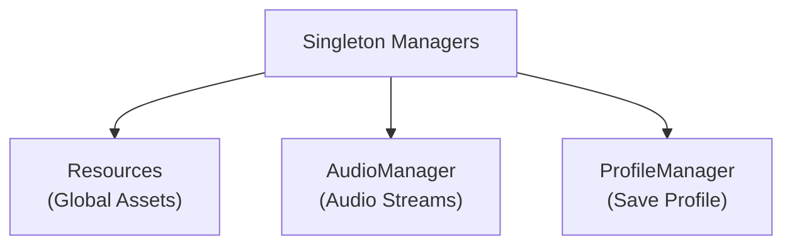

```cpp

// filepath: include/core/resources.h

class Resources {

public:

    // Thread-safe Scott Meyers' Singleton

    static Resources& GetInstance() {

        static Resources instance;

        return instance;

    }

    // Explicitly delete copy constructor and copy assignment operator

    Resources(const Resources&) = delete;

    Resources& operator=(const Resources&) = delete;

    Texture2D GetTexture(const std::string& name);

    std::string GetAssetPath(const std::string& relativePath);

private:

    Resources() = default; // Private constructor prevents direct instantiation

};

// filepath: include/core/AudioManager.h

class AudioManager {

public:

    static AudioManager& GetInstance() {

        static AudioManager instance;

        return instance;

    }

    void PlayMusic(const std::string& musicAsset);

    void PlaySoundEffect(const std::string& soundAsset);

private:

    AudioManager() = default;

};

```

#### Architectural Benefits & SOLID Alignment:

- **Single Responsibility Principle (SRP):** Each manager is dedicated strictly to a single domain (e.g., texture/reanim assets vs. audio streaming pipelines).

- **Memory Efficiency & Zero Leaks:** Prevents redundant asset re-loading; guarantees clean lifetime management bound strictly to process execution.

- **Thread Safety:** Guarantees thread-safe global access across all game levels without requiring manual mutex locking boilerplate in C++11+.

## Strategy Pattern – Dynamic Projectile Physics and Trajectories

#### Problem & Architectural Context:

The gameplay engine supports distinct projectile behaviors across plant categories:

- Linear forward trajectories (*Straight*): PeaShooter, SnowPea, FirePea.

- Parabolic lobbed arcs (*Lobbed*): Cabbage-pult, Corn-pult, Melon-pult.

Hardcoding trajectory physics directly within `Projectile::update()` using monolithic `if-else` or `switch-case` branching violates the Open/Closed Principle (OCP) and makes introducing new projectile flight paths (e.g., homing or boomerang trajectories) error-prone.

#### Solution & C++20 Implementation:

The Strategy Pattern encapsulates trajectory computation into an `ITrajectoryStrategy` interface. The `Projectile` class holds a `std::unique_ptr<ITrajectoryStrategy>` and delegates physical displacement calculations to concrete strategy implementations at runtime.

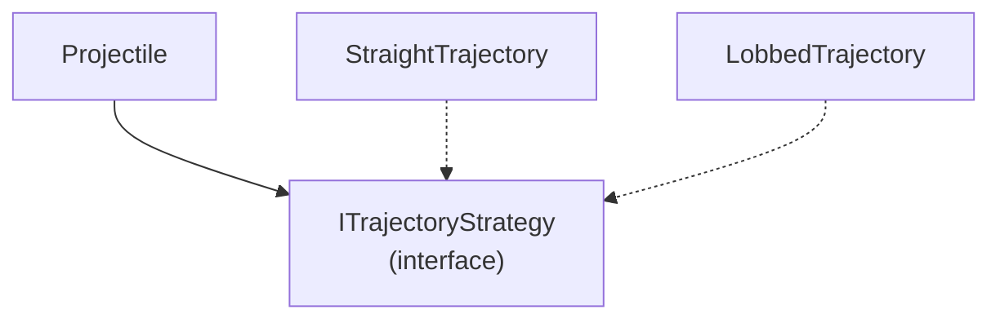

```cpp

// filepath: include/entities/items/TrajectoryStrategy.h

class ITrajectoryStrategy {

public:

    virtual ~ITrajectoryStrategy() = default;

    virtual void updatePosition(float& x, float& y, float startX, float startY, 

                               float speed, float range, float maxHeight, 

                               float& progress, float dt) = 0;

};

// Linear motion strategy for straight projectiles (PeaShooter, SnowPea, FirePea)

class StraightTrajectoryStrategy : public ITrajectoryStrategy {

public:

    void updatePosition(float& x, float& y, float startX, float startY, 

                       float speed, float range, float maxHeight, 

                       float& progress, float dt) override {

        x += speed * dt; // Linear displacement along the horizontal axis

    }

};

// Parabolic arc strategy for lobbed projectiles (Cabbage-pult, Melon-pult)

class LobbedTrajectoryStrategy : public ITrajectoryStrategy {

public:

    void updatePosition(float& x, float& y, float startX, float startY, 

                       float speed, float range, float maxHeight, 

                       float& progress, float dt) override {

        if (range <= 0.0f) range = 400.0f;

        progress += (speed / range) * dt;

        if (progress > 1.0f) progress = 1.0f;

        // Parametric parabolic flight path equation

        x = startX + progress * range;

        float heightOffset = 4.0f * maxHeight * progress * (1.0f - progress);

        y = startY - heightOffset;

    }

};

```

#### Architectural Benefits & SOLID Alignment:

- **Open/Closed Principle (OCP):** New trajectory behaviors can be integrated seamlessly by creating new strategy subclasses without altering existing `Projectile` logic.

- **Decoupling Physics from Entities:** Separates physical mathematical equations from rendering and entity state management, enabling isolated unit testing.

## Observer Pattern – Decoupled Event Notification Bus

#### Problem & Architectural Context:

Key gameplay occurrences—such as collecting sun currency, eliminating a zombie, or losing a plant—require instantaneous responses from decoupled subsystems (HUD counters, audio triggers, achievement progress, wave spawners). Directly invoking UI or audio methods from inside physics collision loops introduces tight coupling and cyclic header dependencies.

#### Solution & C++20 Implementation:

An Event Bus is established using the Observer Pattern. The `IGameObserver` interface acts as the event subscriber contract, while `GameSubject` maintains subscriber lists and broadcasts events without requiring explicit knowledge of consumer concrete types.

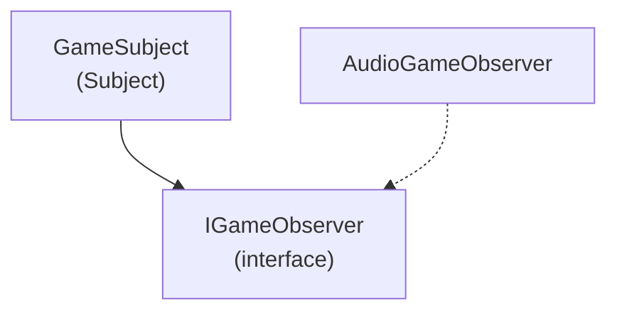

```cpp

// filepath: include/utils/GameObserver.h

class IGameObserver {

public:

    virtual ~IGameObserver() = default;

    virtual void onSunCollected(int amount) {}

    virtual void onZombieKilled(const std::string& zombieName) {}

    virtual void onPlantDestroyed(int row, int col) {}

};

class GameSubject {

private:

    std::vector<IGameObserver*> m_observers;

public:

    void addObserver(IGameObserver* observer) {

        if (observer && std::find(m_observers.begin(), m_observers.end(), observer) == m_observers.end()) {

            m_observers.push_back(observer);

        }

    }

    void removeObserver(IGameObserver* observer) {

        m_observers.erase(std::remove(m_observers.begin(), m_observers.end(), observer), m_observers.end());

    }

    void notifySunCollected(int amount) {

        for (auto* obs : m_observers) if (obs) obs->onSunCollected(amount);

    }

    void notifyZombieKilled(const std::string& zombieName) {

        for (auto* obs : m_observers) if (obs) obs->onZombieKilled(zombieName);

    }

};

```

#### Architectural Benefits & SOLID Alignment:

- **Dependency Inversion Principle (DIP):** Core game logic depends exclusively on abstract event interfaces (`IGameObserver`) rather than concrete UI/Audio implementations.

- **Loose Coupling:** Event subscribers can be attached or detached dynamically at runtime without interrupting the game loop.

## Command Pattern – Encapsulated Plant Placement Actions

#### Problem & Architectural Context:

Planting on the 5x9 lawn grid requires pre-execution validation: verifying sun balance, checking seed packet cooldown status, and validating cell availability. Inlining grid mutation logic directly into mouse input callback functions clutters input handling code and prevents deferred execution.

#### Solution & C++20 Implementation:

The Command Pattern encapsulates plant placement requests into stand-alone `PlantPlacementCommand` objects. Placement actions are captured as executable closures (`std::function<void()>`), decoupling user input parsing from immediate game state mutation.

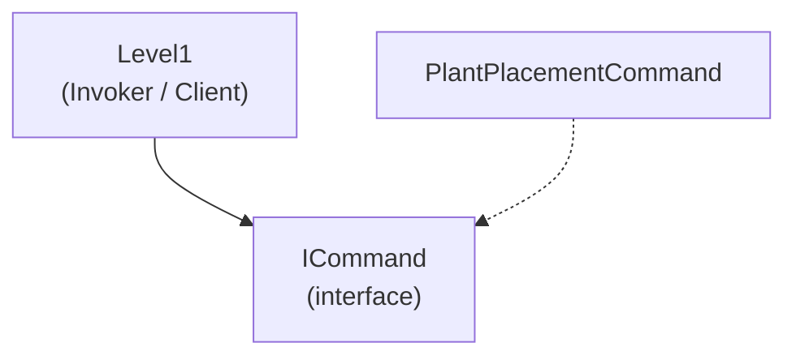

```cpp

// filepath: include/utils/PlantCommand.h

class ICommand {

public:

    virtual ~ICommand() = default;

    virtual void execute() = 0;

};

class PlantPlacementCommand : public ICommand {

private:

    std::function<void()> m_action;

public:

    explicit PlantPlacementCommand(std::function<void()> action) 

        : m_action(std::move(action)) {}

        

    void execute() override {

        if (m_action) {

            m_action(); // Executes encapsulated grid placement logic

        }

    }

};

```

#### Architectural Benefits & SOLID Alignment:

- **Input vs. Execution Decoupling:** Completely separates raw mouse click event handling from grid state modification logic.

- **Extensibility for Macro Queues & Undo:** Provides an extensible foundation for action logging, network serialization, and potential undo/redo capabilities.

## Builder Pattern – Fluent Zombie Wave Construction

#### Problem & Architectural Context:

Level configurations require instantiating complex, heterogeneous zombie waves (consisting of Normal, Conehead, Buckethead, Football, Newspaper, and PoleVaulting zombies) at custom spatial offsets. Manually constructing every zombie instance via raw pointers or inline `make_unique` calls inside level initialization leads to verbose, repetitive code prone to ownership bugs.

#### Solution & C++20 Implementation:

The Builder Pattern provides a method-chaining fluent interface (`ZombieWaveBuilder`) to construct wave compositions step by step. The `build()` method transfers exclusive ownership of the compiled `std::vector<std::unique_ptr<Zombie>>` using C++ move semantics (`std::move`).

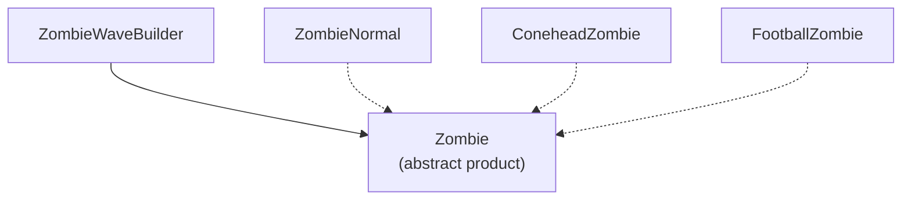

```cpp

// filepath: include/utils/WaveBuilder.h

class ZombieWaveBuilder {

private:

    std::vector<std::unique_ptr<Zombie>> m_zombies;

    Resources& m_res;

public:

    explicit ZombieWaveBuilder(Resources& res) : m_res(res) {}

    

    ZombieWaveBuilder& addNormalZombie(float x, float y) {

        m_zombies.push_back(std::make_unique<ZombieNormal>(m_res, x, y));

        return *this;

    }

    ZombieWaveBuilder& addConeheadZombie(float x, float y) {

        m_zombies.push_back(std::make_unique<ConeheadZombie>(m_res, x, y));

        return *this;

    }

    ZombieWaveBuilder& addFootballZombie(float x, float y) {

        m_zombies.push_back(std::make_unique<FootballZombie>(m_res, x, y));

        return *this;

    }

    

    // Returns completed vector and transfers exclusive ownership via Move Semantics

    std::vector<std::unique_ptr<Zombie>> build() {

        return std::move(m_zombies);

    }

};

```

#### Architectural Benefits & SOLID Alignment:

- **Fluent API Expressiveness:** Dramatically improves readability during level setup via clean method chaining.

- **Memory Safety:** Prevents memory leaks by leveraging `std::unique_ptr` smart pointers combined with strict C++ move semantics.

## Facade Pattern – Unified Engine Subsystem Interface

#### Problem & Architectural Context:

High-level gameplay components (UI screens, level loops, entity update functions) frequently need to interact with multiple core engine subsystems (fetching textures from `Resources`, playing audio from `AudioManager`, querying save state from `ProfileManager`). Having every entity include and manage multiple separate singleton headers creates dense dependency webs (*dependency clutter*).

#### Solution & C++20 Implementation:

The Facade Pattern introduces `GameEngineFacade`, serving as a unified entry point. This class exposes simplified, static wrapper methods that internally coordinate interactions across the low-level core subsystems.

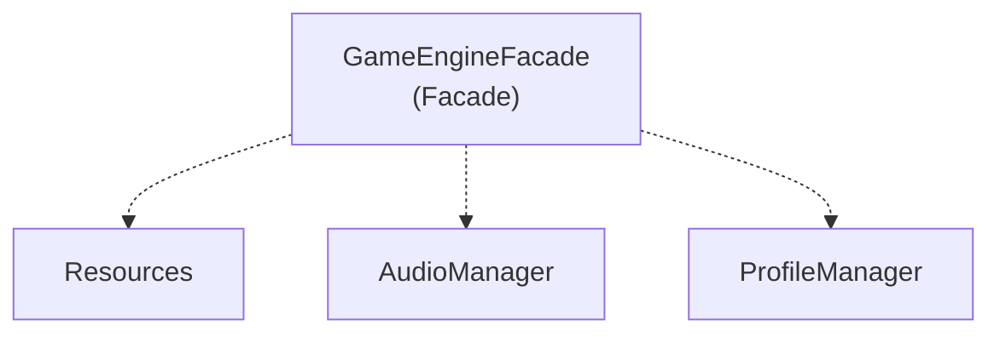

```cpp

// filepath: include/core/GameEngineFacade.h

class GameEngineFacade {

public:

    static void PlaySFX(const std::string& soundAsset) {

        std::string fullPath = Resources::GetInstance().GetAssetPath(soundAsset);

        AudioManager::GetInstance().PlaySoundEffect(fullPath);

    }

    static Texture2D GetTexture(const std::string& name) {

        return Resources::GetInstance().GetTexture(name);

    }

    static ReanimDefinition LoadReanim(const std::string& filePath) {

        return Resources::GetInstance().LoadReanim(filePath);

    }

    static ProfileManager& GetProfile() {

        return ProfileManager::GetInstance();

    }

};

```

#### Architectural Benefits & SOLID Alignment:

- **Reduced Coupling:** Client entities depend strictly on `GameEngineFacade.h` rather than multiple subsystem headers.

- **Subsystem Encapsulation:** Hides multi-step asset resolution procedures (such as `GetAssetPath`) behind clean, single-call static methods.

## Adapter Pattern – Audio Subsystem Interface Adaptation

#### Problem & Architectural Context:

Low-level framework components (such as Raylib audio calls or C-style procedural APIs) do not conform to object-oriented interface hierarchies. Coupling gameplay entity logic directly to a specific procedural library makes swapping or upgrading underlying audio backends difficult.

#### Solution & C++20 Implementation:

An abstract C++ interface `IAudioEngine` defines the target audio contract. The `RaylibAudioAdapter` class implements this interface by wrapping calls to `AudioManager` and Raylib’s native procedural functions.

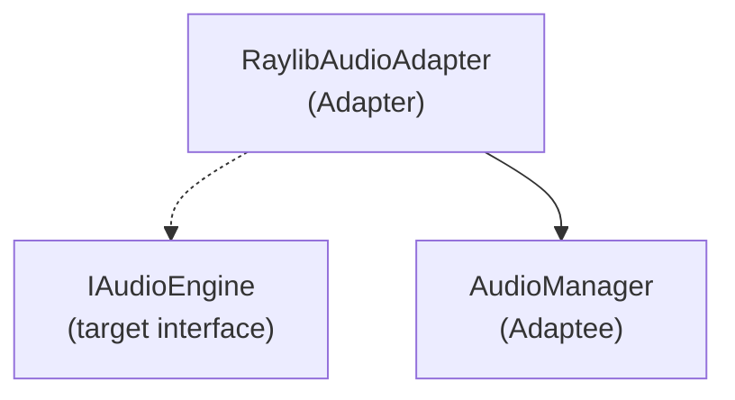

```cpp

// filepath: include/core/AudioAdapter.h

class IAudioEngine {

public:

    virtual ~IAudioEngine() = default;

    virtual void playSound(const std::string& soundAsset) = 0;

};

// Adapter wrapping procedural audio calls into a C++ OOP interface

class RaylibAudioAdapter : public IAudioEngine {

public:

    void playSound(const std::string& soundAsset) override {

        AudioManager::GetInstance().PlaySoundEffect(soundAsset);

    }

};

```

#### Architectural Benefits & SOLID Alignment:

- **Vendor Lock-in Immunity:** Allows swapping the audio backend (e.g., to FMOD, OpenAL, or `SDL_mixer`) by authoring a new adapter class without modifying game logic code.

- **Dependency Inversion Principle (DIP):** Game components interact strictly with the abstract `IAudioEngine` interface.

# Entity System Hierarchy

## Plant Hierarchy

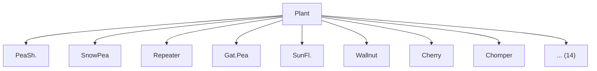

The 22 concrete plant subclasses also include: Cornpult, Melonpult, Cabbagepult, Jalapeno, Squash, FirePea, Torchwood, Garlic, PotatoMine, Caltrop, SpikeRock, Gravebuster, IceShroom, and additional support variants.

## Zombie Hierarchy

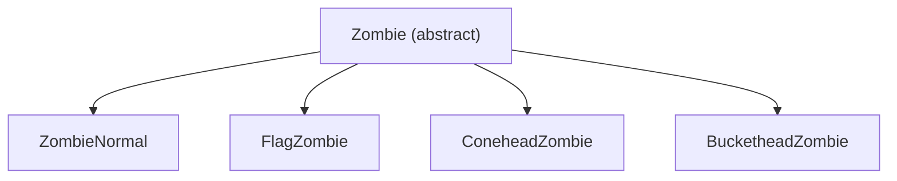

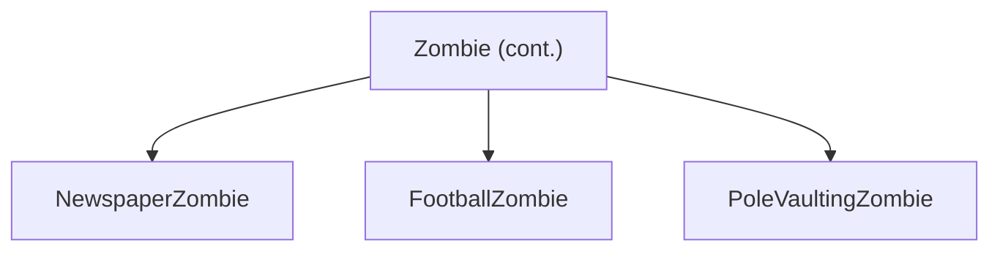

Total: **7 concrete zombie subclasses**. Each overrides `update()`, `draw()`, and optionally `takeDamage()` for armor-specific behavior (falling cone, bucket, helmet, newspaper).

## Item & Auxiliary Entities

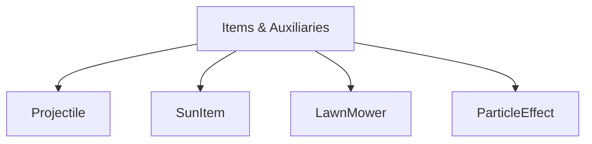

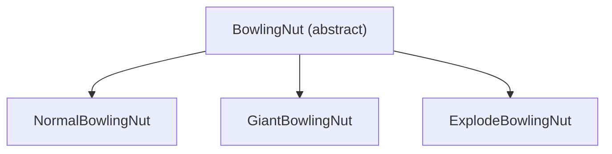

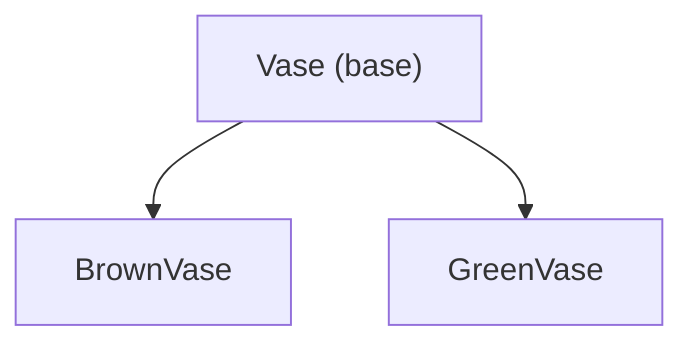

# State Management Hierarchy

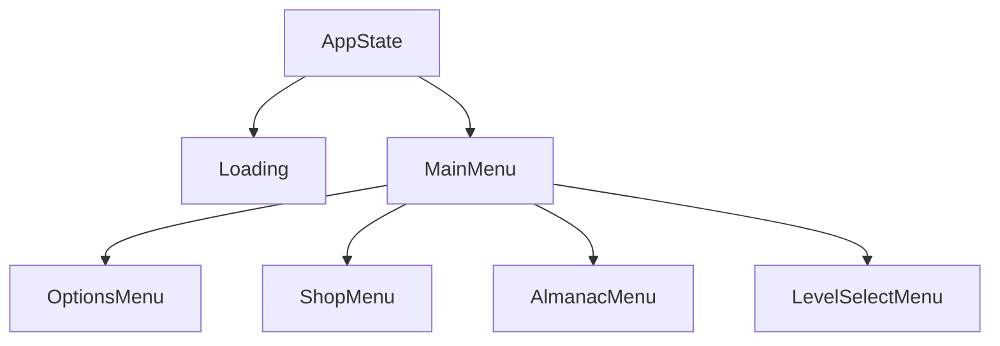

Within each level, the `LevelPhase` state machine governs the gameplay flow:

```math

\texttt{SeedSelection} \longrightarrow \texttt{PanToLawn} \longrightarrow \texttt{ReadySetPlant} \longrightarrow \texttt{ActiveWave}

```

# Resource Management Hierarchy

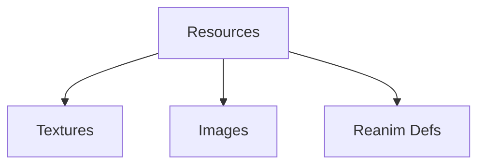

The loading system uses a progressive queue: `PrepareAssetLoadingQueue()` scans directories, `StepAssetLoadingQueue()` loads batches each frame, and `GetLoadingProgress()` drives the loading bar UI.

# Animation System Hierarchy

The project uses a custom recreation of PopCap’s **Reanimation Engine** to render all plant and zombie sprites.

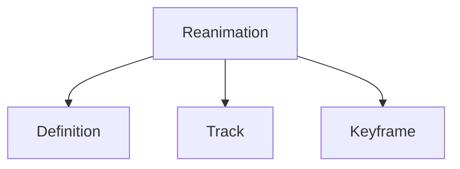

Key capabilities:

- Multi-track bone animation with per-frame transform interpolation.

- Named animation ranges (`anim_idle`, `anim_shooting`, `anim_death`, etc.).

- Runtime track visibility toggling and texture overrides for dynamic armor removal.

- Frame-accurate event detection (e.g., fire projectile at frame $N$ of shooting animation).

# Combat System Hierarchy

The combat system consists of four interconnected subsystems managed within each Level class:

1.  **Projectile System:** `Projectile` objects with type flags (snow, fire, melon, butter, lobbed) and configurable speed, damage, scale, and trailing particle effects.

2.  **Collision Detection:** Per-frame AABB collision checks between all `Projectile`s and `Zombie`s, applying damage, slow effects, fire ignition (via Torchwood), and splash damage for melons.

3.  **Damage Model:** Armoured zombies (`ConeheadZombie`, `BucketheadZombie`, `FootballZombie`) override `takeDamage()` to detach armor parts (`FallingPart`) at HP thresholds before delegating to the base implementation.

4.  **Lawn Mower Defense:** `LawnMower` objects sit at the left edge of each lane; when a zombie reaches them, they trigger and sweep across the lane, instantly killing all zombies in their path.

```

// filepath: include/entities/items/Projectile.h

class Projectile {

private:

    float m_x, m_y, m_speed;

    Texture2D m_tex;

    bool m_active, m_isSnow, m_isFire, m_isMelon, m_isButter, m_isLobbed;

    float m_range, m_maxHeight, m_scale;

    int m_damage;

    ParticleEffect efftrailing;

    Reanimation m_fireAnim;

public:

    Projectile(float x, float y, float speed, Texture2D tex,

               bool isSnow = false, bool isLobbed = false,

               float scale = 1.0f, int damage = 20, ...);

    void ignite(Texture2D fireTex = {0}); // Torchwood fire conversion

    void onHit();

    // ... getters for type checks

};

```

# Level & World System Hierarchy

## Level Class Hierarchy

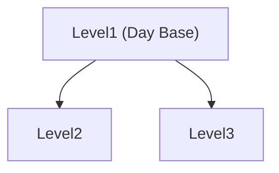

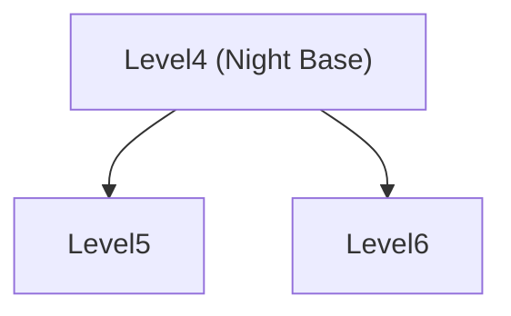

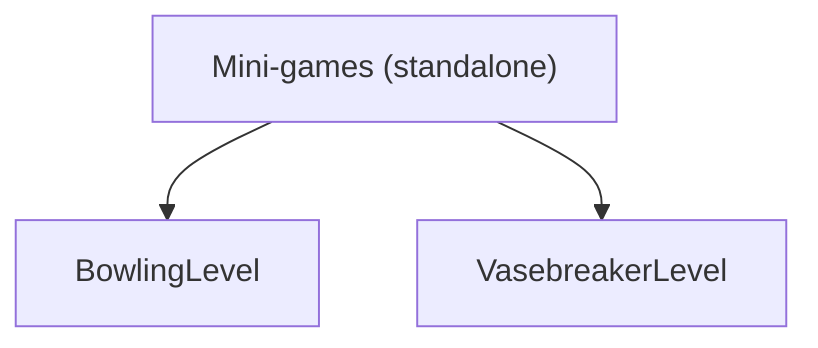

## Night Level Extensions

`Level4` extends the day-level template with:

- `GraveStone` structs placed on the grid, blocking planting and spawning rising zombies.

- `RisingZombie` animation system for zombies emerging from graves.

- Fog rendering (`drawFog()`) that gradually obscures the right side of the lawn.

- `Gravebuster` plant interaction to destroy gravestones.

## Grid & Collision Architecture

Each level owns:

- `std::unique_ptr<Plant> m_grid[5][9]` — the $5 \times 9$ lawn grid.

- `std::vector<std::unique_ptr<Zombie>> m_zombies` — active zombie pool.

- `std::vector<Projectile> m_projectiles` — live projectiles.

- `std::vector<SunItem> m_suns` — collectible sun items.

- `std::vector<ParticleEffect> m_effects` — visual particles.

- `std::vector<LawnMower> m_lawnMowers` — one per lane.

The `updateCollisions(dt)` method performs per-frame row-based AABB intersection to resolve projectile–zombie, zombie–plant, zombie–lawnmower, and area-of-effect interactions.

# UI System Hierarchy

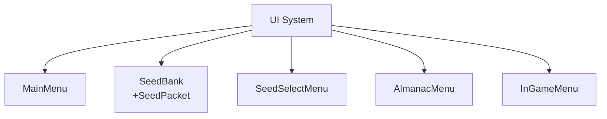

- **SeedBank + SeedPacket:** In-game HUD displaying the player’s chosen deck, sun counter, cooldown timers, and shovel tool. Manages plant selection and sun deduction.

- **SeedSelectMenu:** Pre-level deck builder. Displays all unlocked plants as selectable cards; the player drags up to 7 into their deck before pressing “LET’S ROCK!”

- **AlmanacMenu:** Interactive encyclopedia with live reanimation previews of every plant and zombie, including stats, descriptions, and flavor text.

- **ShopMenu:** Crazy Dave’s shop with paginated seed packet catalog, coin bank display, and purchase/unlock flow integrated with `ProfileManager`.

- **InGameMenu:** Pause menu overlay with volume sliders, restart, and main menu buttons.

- **LevelSelectMenu:** Day/Night stage selector with tombstone-style level cards and locked-level gating.

- **BitmapFont:** PopCap-style bitmap font renderer supporting 5 font families with kerning, rotation, centering, and right-alignment.

# Architectural Analysis

## Hierarchy Strengths

1.  **Clear Separation of Concerns**

    - `core/` — Engine infrastructure: resource loading, audio, fonts, animation, profiles.

    - `entities/` — Game object behavior: plants, zombies, items.

    - `level/` — Gameplay loop: grid, waves, collisions, win/lose.

    - `ui/` — Menus and interface: main menu, seed selection, almanac, shop.

2.  **Design Pattern Integration**

    - *Singleton Pattern:* Three centralized managers (Resources, AudioManager, ProfileManager).

    - *Template Method / Polymorphism:* Pure-virtual `update()`/`draw()` in Plant and Zombie hierarchies.

    - *State Pattern:* AppState for top-level flow; LevelPhase for intra-level flow; SquashState and VaseState for entity behavior.

    - *Factory Method:* `createPlant()`, `BowlingNut::Create()` for type-driven instantiation.

    - *Observer Pattern:* Sun collection notification chain between SunItem and SeedBank.

3.  **Extensibility**

    - Adding a new plant requires only a new `.h`/`.cpp` pair inheriting from `Plant` and a line in the factory — zero changes to the level loop.

    - Day levels (Level2, Level3) and night levels (Level5, Level6) inherit from their respective bases with minimal overrides.

    - The Reanimation engine supports any PopCap `.reanim` file without code changes.

4.  **Performance Considerations**

    - Zero-allocation keyframe interpolation in hot animation loops.

    - Packed integer kerning map (`uint16_t`) to avoid per-glyph string allocations in font rendering.

    - Progressive asset loading with batched file I/O to prevent frame drops during startup.

    - Lazy texture caching in UI components to bypass repeated string lookups.

## Key Design Decisions

1.  **Raylib + C++20:** Lightweight graphics library with zero external dependencies beyond the C standard library, compiled via CMake with FetchContent for raylib, raygui, and nlohmann_json.

2.  **Custom Reanimation Engine:** Faithful recreation of PopCap’s XML-based skeletal animation system, enabling direct use of original `.reanim` assets.

3.  **Grid-Based Architecture:** The $5 \times 9$ `unique_ptr<Plant>` grid provides O(1) plant placement and row-based collision filtering.

4.  **Level Inheritance:** Day and Night base levels share 90%+ logic; derived levels only override `spawnNextWave()` and `getUniqueLevelZombieTypes()` for content variation.

5.  **Profile Persistence:** JSON-based user profiles (via nlohmann_json) store progression independently from code, enabling multiple save slots.

# Work Division and Team Contributions

To ensure efficient development and maintain a clear separation of concerns, the project responsibilities were divided based on architectural domains: **Engine Architecture & UI Subsystems** vs. **Gameplay Mechanics & Entity Systems**. Both team members contributed equally to the research, implementation, and refinement of the codebase.

| **Full Name** | **Student ID** | **Core Responsibilities & Major Deliverables** | **Contribution** |
|:---|:---:|:---|:---:|
| **Nguyễn Phúc Khánh** | 25125086 | • Lead Architecture & Build Automation (CMake, GitHub CI)<br>• Core Infrastructure Managers (Resources, AudioManager)<br>• Complete User Interface Suite (Menus, Shop, Almanac)<br>• Special Game Modes (Wall-nut Bowling, Vasebreaker) | 50% |
| **Từ Hoàng Anh** | 25125005 | • Plant & Zombie Entity Class Hierarchies (15+ Classes)<br>• Physics Trajectory Strategy (Straight, Lobbed, Ignition)<br>• Level Design, Grid Management & Wave Timing (Day/Night)<br>• Gameplay Balancing & Interactive Visual Features | 50% |

## High-Level Domain Breakdown

#### Nguyễn Phúc Khánh (ID: 25125086) – Architecture, Subsystems & UI Suite

- **Build System & CI/CD:** Configured multi-platform CMake automation, dependency management via FetchContent, and automated GitHub Actions integration.

- **Core Subsystem Infrastructure:** Implemented Scott Meyers’ Singleton managers for thread-safe texture, audio, and user profile handling (`Resources`, `AudioManager`, `ProfileManager`).

- **User Interface (UI) Suite:** Designed and implemented all game screens, including `LoadingScreen`, `MainMenu`, `OptionsMenu`, `ShopMenu` (Crazy Dave’s Shop), `AlmanacMenu`, `SeedChooser`, and `LevelSelect`.

- **Minigame Modes:** Developed the conveyor-belt physics for `Wall-nut Bowling` and the grid smashing/mallet mechanics for `Vasebreaker`.

#### Từ Hoàng Anh (ID: 25125005) – Gameplay Mechanics, Entities & Level Design

- **Entity Hierarchies:** Engineered combat logic, states, and animation setups for all 15+ Plant subclasses and Zombie variants (Normal, Conehead, Buckethead, PoleVaulting).

- **Physics & Trajectories:** Developed linear and parabolic lobbed projectile flight paths (`ITrajectoryStrategy`) and element transformations (e.g., Torchwood pea ignition).

- **Level Design & Wave Engine:** Structured the main 5x9 lawn grid, wave spawning timers, sun currency collection (`SunItem`), and Night Mode environmental mechanics.

- **Game Balancing & Visual Polish:** Implemented zombie limb dismemberment physics, custom cloud environmental shaders/animations, quiz dialogs, and game difficulty tuning.
